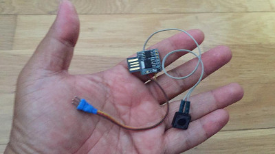

# Digispark Timer

Simple timer for electric free-flight planes

# 

### Installation

Follow the Didispark installation tutorial: http://digistump.com/wiki/digispark/tutorials/connecting

> Note for 64bit Linux - You may have to recompile the micronucleus commandline tool. Get it from https://github.com/micronucleus/micronucleus

